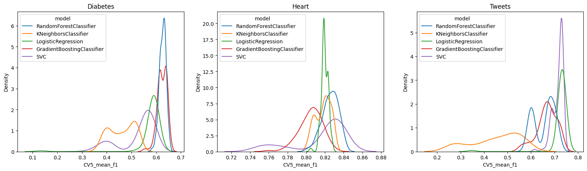

# Report

## Results

First three tables show the metrics for the best chosen model for
each dataset.
 

<table>
<thead>
<tr class="header">
<th colspan="3" style="text-align: center;">Diabetes results</th>
</tr>
</thead>
<tbody>
<tr class="odd">
<td style="text-align: left;">Model</td>
<td style="text-align: left;">CV5_mean_f1</td>
</tr>
<tr class="even">
<td
style="text-align: left;"><strong>GradientBoostingClassifier</strong></td>
<td style="text-align: left;">0.65</td>
</tr>
<tr class="odd">
<td style="text-align: left;">KNeighborsClassifier</td>
<td style="text-align: left;">0.52</td>
</tr>
<tr class="even">
<td style="text-align: left;">LogisticRegression</td>
<td style="text-align: left;">0.6</td>
</tr>
<tr class="odd">
<td style="text-align: left;">RandomForestClassifier</td>
<td style="text-align: left;">0.65</td>
</tr>
<tr class="even">
<td style="text-align: left;">SVC</td>
<td style="text-align: left;">0.59</td>
</tr>
<tr class="even">
<td style="text-align: left;">NeuralFCA (pima.ipynb)</td>
<td style="text-align: left;">0.04</td>
</tr>
</tbody>
</table>
<table>
<thead>
<tr class="header">
<th colspan="3" style="text-align: center;">Heart results</th>
</tr>
</thead>
<tbody>
<tr class="odd">
<td style="text-align: left;">Model</td>
<td style="text-align: left;">CV5_mean_f1</td>
</tr>
<tr class="even">
<td style="text-align: left;">GradientBoostingClassifier</td>
<td style="text-align: left;">0.83</td>
</tr>
<tr class="odd">
<td style="text-align: left;">KNeighborsClassifier</td>
<td style="text-align: left;">0.82</td>
</tr>
<tr class="even">
<td style="text-align: left;">LogisticRegression</td>
<td style="text-align: left;">0.82</td>
</tr>
<tr class="odd">
<td
style="text-align: left;"><strong>RandomForestClassifier</strong></td>
<td style="text-align: left;">0.84</td>
</tr>
<tr class="even">
<td style="text-align: left;">SVC</td>
<td style="text-align: left;">0.84</td>
</tr>
<tr class="even">
<td style="text-align: left;">NeuralFCA (heart.ipynb)</td>
<td style="text-align: left;">0.29</td>
</tr>
</tbody>
</table>
<table>
<thead>
<tr class="header">
<th colspan="3" style="text-align: center;">Tweets results</th>
</tr>
</thead>
<tbody>
<tr class="odd">
<td style="text-align: left;">Model</td>
<td style="text-align: left;">CV5_mean_f1</td>
</tr>
<tr class="even">
<td style="text-align: left;">GradientBoostingClassifier</td>
<td style="text-align: left;">0.73</td>
</tr>
<tr class="odd">
<td style="text-align: left;">KNeighborsClassifier</td>
<td style="text-align: left;">0.58</td>
</tr>
<tr class="even">
<td style="text-align: left;">LogisticRegression</td>
<td style="text-align: left;">0.73</td>
</tr>
<tr class="odd">
<td style="text-align: left;">RandomForestClassifier</td>
<td style="text-align: left;">0.71</td>
</tr>
<tr class="even">
<td style="text-align: left;"><strong>SVC</strong></td>
<td style="text-align: left;">0.74</td>
</tr>
<tr class="even">
<td style="text-align: left;">NeuralFCA (tweets.ipynb)</td>
<td style="text-align: left;">0.04</td>
</tr>
</tbody>
</table>

## NeuralFCA details

To binarize the data, KBinsDiscretizer was used for numerical arguments. For text (tweets.ipynb), CountVectorizer was used with LogisticRegression to get the "most relevant words".

Comparing to other methods, NeuralFCA got very poor results. Most of the folds result in "the most probable class" prediction (so, all zeros), which makes f1-score equal to 0. 

The main limitation of the method is that it can only work with binary attributes; this means that the number of features required to adequately represent the data grows very fast: e.g., in order to represent a single numerical attribute, one could 5 bins, resulting in 5 binary attributes.

Besides, even with the same set of features, in tweets.ipynb it was found that the method performs much worse (4-5 times) than simple LogisticRegression model.

Due to the amount of time it takes to fit a single model, and the number of hyperparameters involved (data preprocessing, feature selection, cross validation) -- it is possible that the optimal configuration for the model was not achieved.

For Heart and Diabetes datasets, all the available features were used; I've experimented with the number of bins in preprocessing.

For tweets, I've experimented with the number of words to pick from LogisticRegression model. In the notebooks, the best found runs are presented.

## Classical models details (fitting details are not presented in this repository)

The results of the experiments are shown in Figure 1.

<figure>

<figcaption aria-hidden="true">Figure 1. Summary of classification
results</figcaption>
</figure>

F1 classification scores were
collected for each fold (out out total 5) and averaged, resulting in
CV5_mean_f1 score. For each
dataset, a total number of 500 iterations was run; the model and the
hyperparameters were chosen at random (either from a predefined range or
sampled from a distribution). So the randomness inside each model comes
from hyperparameter choice. A kernel density estimate (KDE) of the
scores distribution was used. As a result, tails of the distributions
might not be completely accurate.

Categorical features were One-Hot-Encoded. Multiple strategies for
filling in missing values were tried.

For tweets dataset, <a
href="https://scikit-learn.org/stable/modules/generated/sklearn.feature_extraction.text.TfidfVectorizer.html">TF-IDF</a>
features were used with varying number of max_features.
